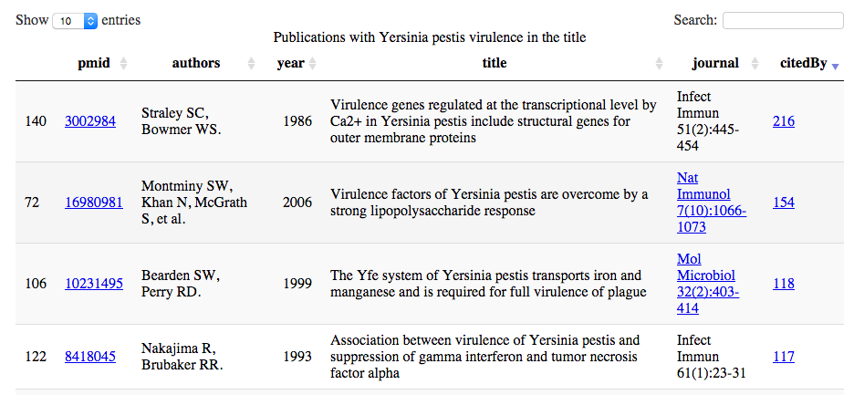
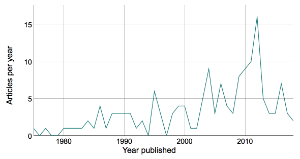

## euPMC


Europe PubMed Central ([Europe PMC](http://europepmc.org/About)) contains over 30 million publications and the `euPMC` package uses the [REST services](http://europepmc.org/RestfulWebService) for searching.  Additional functions are used to output reference lists, Javascript DataTables and publication time series. Use `devtools` to install the package from GitHub.

```r
library(devtools)
install_github("cstubben/euPMC")
library(euPMC)
```

The main search function is `search_lite` and requires a valid [query string](https://europepmc.org/Help#directsearch), in this example to search for publications with Yersinia pestis virulence in the title and then to download eight papers citing Lathem et al. 2014 in row 7. 

```r
yp <- search_lite("title:(Yersinia pestis virulence)")
## 156 Results
t(yp[7,])
              7                                                                                                                                                 
pmid          "24520064"                                                                                                                                        
authorString  "Lathem WW, Schroeder JA, Bellows LE, Ritzert JT, Koo JT, Price PA, Caulfield AJ, Goldman WE."                                                    
pubYear       "2014"                                                                                                                                            
title         "Posttranscriptional regulation of the Yersinia pestis cyclic AMP receptor protein Crp and impact on virulence."                                  
journalTitle  "MBio"                                                                                                                                            
journalVolume "5"                                                                                                                                               
issue         "1"                                                                                                                                               
pageInfo      "e01038-13"                                                                                                                                       
citedByCount  "8"                                                                                                                                               
pmcid         "PMC3950509"                                                                                                                                      
DOI           NA                                                                                                                                                
pubType       "journal article; citations from index medicus journals; research support, non-u.s. gov't; research support, n.i.h., extramural; research-article"
```

```r
x <- search_lite( "cites:24520064_MED")
## 8 Results
```
`bib_format` uses helper functions `authors_etal` and `journal_cite` to format author, year, title and journal and optionally Pubmed IDs and cited by counts into a reference list.  Markdown links are added to journals using the DOI and to PubMed IDs and Cited By counts if displayed.


```r
strwrap(bib_format(x, number=TRUE, links=TRUE), width=100, exdent=3)
```

1. Zimbler DL, Schroeder JA, Eddy JL, Lathem WW. 2015. Early emergence of Yersinia pestis as a
   severe respiratory pathogen. [Nat Commun 6:7487](http://dx.DOI.org/10.1038/ncomms8487).
2. Nuss AM, Heroven AK, Waldmann B, et al. 2015. Transcriptomic profiling of Yersinia
   pseudotuberculosis reveals reprogramming of the Crp regulon by temperature and uncovers Crp as a
   master regulator of small RNAs. [PLoS Genet
   11(3):e1005087](http://dx.DOI.org/10.1371/journal.pgen.1005087).
3. Ross JA, Trussler RS, Black MD, et al. 2014. Tn5 transposition in Escherichia coli is repressed
   by Hfq and activated by over-expression of the small non-coding RNA SgrS. [Mob DNA
   5(1):27](http://dx.DOI.org/10.1186/s13100-014-0027-z).
4. Heroven AK, Dersch P. 2014. Coregulation of host-adapted metabolism and virulence by pathogenic
   yersiniae. [Front Cell Infect Microbiol 4:146](http://dx.DOI.org/10.3389/fcimb.2014.00146).
5. Eddy JL, Gielda LM, Caulfield AJ, et al. 2014. Production of outer membrane vesicles by the
   plague pathogen Yersinia pestis. [PLoS One
   9(9):e107002](http://dx.DOI.org/10.1371/journal.pone.0107002).
6. Caulfield AJ, Lathem WW. 2014. Disruption of fas-fas ligand signaling, apoptosis, and innate
   immunity by bacterial pathogens. [PLoS Pathog
   10(8):e1004252](http://dx.DOI.org/10.1371/journal.ppat.1004252).
7. Papenfort K, Vogel J. 2014. Small RNA functions in carbon metabolism and virulence of enteric
   pathogens. [Front Cell Infect Microbiol 4:91](http://dx.DOI.org/10.3389/fcimb.2014.00091).
8. Schiano CA, Koo JT, Schipma MJ, et al. 2014. Genome-wide analysis of small RNAs expressed by
   Yersinia pestis identifies a regulator of the Yop-Ysc type III secretion system. [J Bacteriol
   196(9):1659-1670](http://dx.DOI.org/10.1128/jb.01456-13).

`DT_format` adds html links to PubMed IDs, journal, and cited by counts for displaying using the `datatable` function in the DT package.  Click the [link](http://cstubben.github.io/genomes/yp.html) or image to view the interactive table. 


```r
library(DT)
y<-DT_format(yp)
datatable(y, escape = c(1,5),  caption="Publications with Yersinia pestis virulence in the title") 
```

[](http://cstubben.github.io/genomes/yp.html)

The `year_ts` function creates yearly time-series objects using the publication year.


```r
y <- year_ts(yp)
plot(y, xlab="Year published", ylab="Articles per year", las=1)
```

Many time series objects can be combined and then plotted in a single plot or interactive [dygraph](http://cstubben.github.io/genomes/FigS1.html).  In this plot, citations to 65 marine genome publications funded by the Gordon and Betty Moore Foundation are plotted using the `dygraphs` package.  Click the [link](http://cstubben.github.io/genomes/FigS1.html) or image to view the interactive plot. 

[](http://cstubben.github.io/genomes/FigS1.html)
